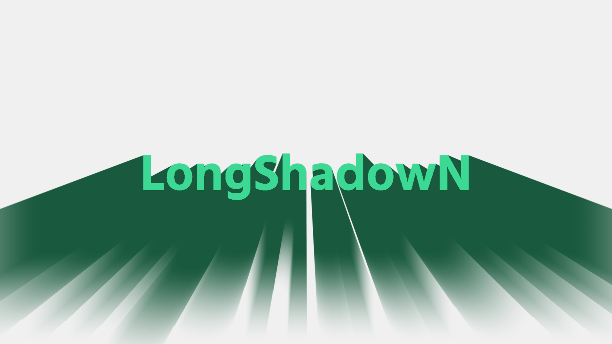

# LongShadowN

3種類のロングシャドウを作成できるスクリプト

## 最新 / Latest

**r6**

## 変更履歴 / Change log

- r6
  - `Blur Shadow` を、影の根元から離れるほどボケ量が強くなる方式に変更
  - `Blur Shadow` の範囲を `0–4000`、刻みを `0.1` に変更

- r5
  - 一部パラメータの有効小数点を変更

- r4
  - 特定状況でしか動作しない一部パラメータが隠されない問題の修正

- r3
  - 一部グループの初期状態をOpenに変更

- r2
  - `Object Color` の `Mix / Opacity` が反映されない問題を修正
  - `Shadow::Opacity` が元オブジェクトの透明度に影響する問題を修正
  - `Fade In / Fade Out` の範囲を `0–100` に変更
- r1
  - 初版
